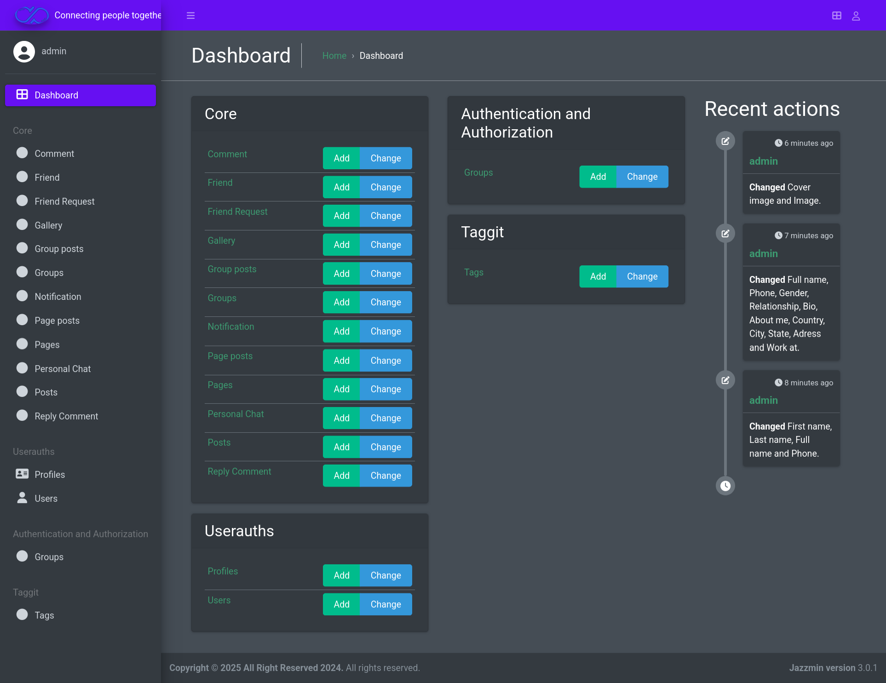

#🌐 Django Social Media

##🌐 Facebook Clone

## Description

This project is a clone of the popular social media platform, Facebook. It aims to replicate key features such as user authentication, posting updates, and interacting with friends. The goal is to provide a learning platform for developers interested in web development and social media application functionalities.

## Tech Stack

- **Frontend:**
  - HTML
  - CSS
  - JavaScript

- **Backend:**
  - Python (Django framework)

- **Database:**
  - SQLite

## Features

- User authentication (sign up, log in)
- Create and manage posts
- Friend requests and interactions
- Responsive design for mobile compatibility

## Getting Started

### Prerequisites

Make sure you have Python and pip installed on your machine.

### Clone the Repository

    git clone https://github.com/Islam412/Facebook-Clone.git
    cd Facebook-Clone

### Install Dependencies

    pip install -r requirements.txt

### Run the Project

1. Apply migrations:

        python manage.py migrate

1. Create a superuser (optional):

        python manage.py createsuperuser

3. Start the development server:

        python manage.py runserver

4. Open your web browser and go to `http://127.0.0.1:8000` to view the application.

### Project Demo

### Project Admin
